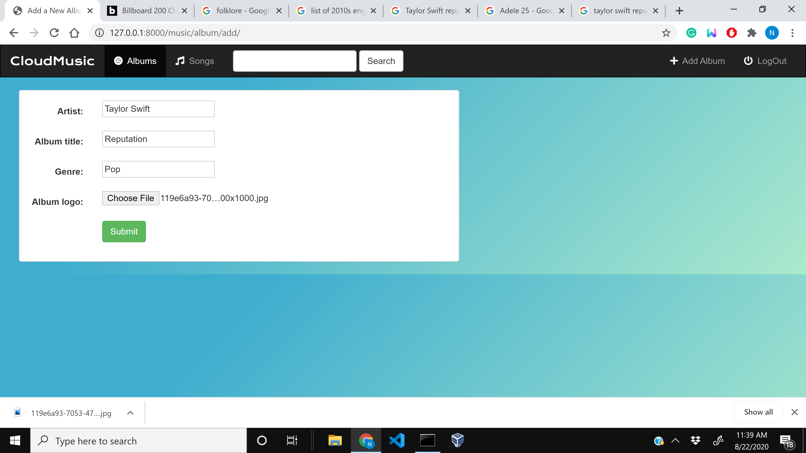

# django
#CloudMusic is an application that lets you upload,store albums and play all of your music from the cloud.Once songs are added to the album you are then able to play ,favorite and delete them.Designed using Django,BootStrap,HTML and CSS.

<h1>Front Page of the CloudMusic </h1>

<h2>How to Add Album </h2>

<h2>After Adding Album </h2>

<h2>After Adding all Songs </h2>

<h2>"How to add Songs.png"</h2>

Note : The Play button won't play any songs (because I avoided due to copyright issue)

